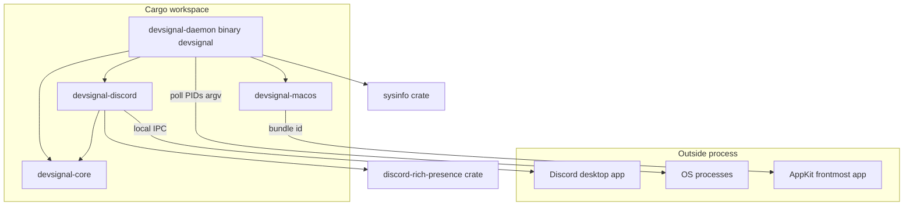
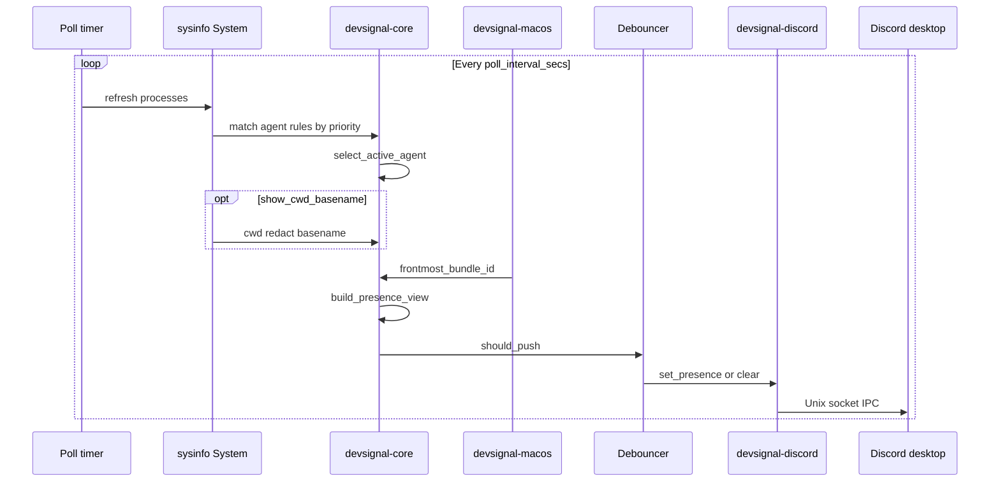
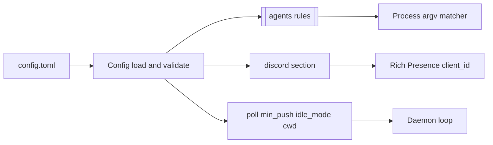
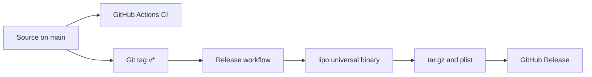

# devsignal

Unified **Discord Rich Presence** for AI coding CLIs on **macOS**. One daemon, one Discord connection: it detects which agent-style tool is running (for example Claude Code, Codex, OpenCode — configurable) and shows the **frontmost host app** (Cursor, VS Code, JetBrains, terminals, etc.).

## Discord application setup

1. Open the [Discord Developer Portal](https://discord.com/developers/applications) and **New Application**.
2. In **OAuth2** (optional for local IPC): not required for Rich Presence; you only need the app record.
3. Copy **Application ID** (this is the Rich Presence `client_id`).
4. Under **Rich Presence → Art Assets**, upload PNGs. Each **image key** must match what you put in `config.toml` (`large_image` per agent and the global default).
5. Install and run the **Discord desktop** client (not only the web app). The daemon connects over local IPC.

## Quick start

1. Run the interactive wizard:

```bash
cargo run -p devsignal-daemon -- init
```

2. Run the daemon:

```bash
cargo run --release -p devsignal-daemon -- run
```

Leave **Discord desktop** open; the daemon talks to it over local IPC. If Discord is not running yet, the daemon **retries IPC for up to 30 seconds** by default (`--wait-for-discord`; use `--no-wait-for-discord` to fail fast).

### Privacy presets

`devsignal init` offers presets:

- **Minimal**: agent + frontmost host app only.
- **Project-safe**: also shows the **project basename** (never full paths).
- **Public/OSS**: polished defaults; no project names by default.
- **Custom**: choose per-option.

### Manual setup (fallback)

If you prefer not to use the wizard:

1. Scaffold config (from repo root): `./scripts/setup-local-config.sh` — or copy `config.example.toml` to `~/.config/devsignal/config.toml` yourself.
2. Set `discord.client_id` to your Application ID.

### CLI

| Command | Purpose |
| --- | --- |
| `devsignal` / `devsignal run` | Long-running daemon (default config path unless `--config`) |
| `devsignal init [--config path]` | Interactive onboarding wizard: writes config, validates, optional local install + LaunchAgent |
| `devsignal validate --config ~/.config/devsignal/config.toml` | Load and validate config; print agent rules |
| `devsignal once --config …` | One sample: print JSON `PresenceView` (no Discord IPC) for debugging matchers |

### Releases (prebuilt macOS universal binary)

Tagged releases attach `devsignal-<version>-macos-universal.tar.gz` and the example LaunchAgent plist. Upstream:

```text
https://github.com/rabbive/devsignal/releases/latest
```

Extract the tarball and place `devsignal` on your `PATH` (for example `~/bin/devsignal`).

### Installer script

From a clone of this repo:

```bash
# Optional: override repo (default is rabbive/devsignal)
# export DEVSIGNAL_GITHUB_REPO="yourfork/devsignal"
chmod +x packaging/macos/install.sh
./packaging/macos/install.sh
```

This downloads the latest GitHub Release, installs to `~/bin/devsignal`, scaffolds `~/.config/devsignal/config.toml` from `config.example.toml` if missing, and optionally loads the LaunchAgent plist.

### Homebrew (tap)

Use [`packaging/homebrew/devsignal.rb`](packaging/homebrew/devsignal.rb) as a template in your own tap: after the matching GitHub Release exists, set `sha256` via `shasum -a 256` on the downloaded `devsignal-<version>-macos-universal.tar.gz` (see comments in the formula).

### macOS permissions

Host detection prefers **AppKit** (`NSWorkspace` / `NSRunningApplication`). If that path returns nothing **twice in a row**, the daemon falls back to AppleScript (`osascript`) against **System Events**, which may prompt for **Automation** access for the app that launches `devsignal` (for example Terminal, iTerm2, or Cursor).

## Configuration

- `poll_interval_secs`: how often processes and the frontmost app are sampled.
- `min_push_interval_secs`: minimum time between Discord presence updates unless the active agent changes (reduces flicker and rate limits).
- `idle_mode`: `status` (default) shows an idle line when no agent is detected; `clear` calls Discord **CLEAR_ACTIVITY** so nothing is shown for this application.
- `show_cwd_basename`: when `true`, appends the **basename only** of the winning agent process working directory (never full paths). Off by default for privacy.
- `[[agents]]`: `process_names` match **case-insensitively** against the `sysinfo` process name **or** the **basename of argv0** (so wrapped CLIs like `node …/codex` can match `codex`). Optional `argv_substrings` narrow matches when non-empty (**case-insensitive** substring match on the full command line).
- `priority`: **lower number wins** when multiple agents match.

## Architecture

The repo is a **Rust workspace**: shared logic in `devsignal-core`, macOS host detection in `devsignal-macos`, Discord IPC in `devsignal-discord`, and the `devsignal` CLI / main loop in `devsignal-daemon`.

### Crate map



- **`devsignal-core`**: config (`toml`), agent rules, matching, `PresenceView`, debouncing — no UI, no Discord.
- **`devsignal-macos`**: frontmost application / host surface on macOS (AppKit).
- **`devsignal-discord`**: Rich Presence via `discord-rich-presence` → Discord **desktop** IPC.
- **`devsignal-daemon`**: CLI (`run` / `validate` / `once`), main loop: processes → agent → optional CWD hint → bundle → presence → debounce → push or clear.

### Runtime flow (`devsignal run`)



On **SIGINT/SIGTERM**, the daemon clears Rich Presence for this Discord application, then exits.

### Config and policy



### Build and release



CI runs **fmt** and **clippy** (Linux exercises Linux-safe crates; macOS runs the **full** workspace). Pushing a **`v*`** tag triggers [`.github/workflows/release.yml`](.github/workflows/release.yml): cross-compile **aarch64** and **x86_64**, **`lipo`** a universal `devsignal`, package `devsignal-<version>-macos-universal.tar.gz` and attach the example LaunchAgent plist to the release.

### Extension points

| Area | Today | Natural next step |
| --- | --- | --- |
| Host OS | macOS-only host code in `devsignal-macos` | Separate crate + shared traits in core for other platforms |
| Agents | TOML `process_names` / `argv_substrings` | More rules or config reload |
| Discord | Local IPC to desktop client | Unchanged for Rich Presence; assets stay in the Developer Portal |
| Distribution | Unsigned release binary in CI | Optional `codesign` / `notarytool` for Gatekeeper-friendly installs |

## LaunchAgent (login item)

Use an absolute path to the `devsignal` binary in the plist **ProgramArguments**.

Example plist: [`packaging/macos/com.devsignal.daemon.example.plist`](packaging/macos/com.devsignal.daemon.example.plist)

Suggested log directory (referenced in the plist):

```text
~/Library/Logs/devsignal/
```

Create it before loading the agent:

```bash
mkdir -p ~/Library/Logs/devsignal
```

Copy the plist to `~/Library/LaunchAgents/`, edit paths, then:

```bash
launchctl bootstrap gui/$(id -u) ~/Library/LaunchAgents/com.devsignal.daemon.plist
```

Privacy defaults: keep `show_cwd_basename = false` unless you are comfortable exposing folder names in Discord.

### Graceful shutdown

Press **Ctrl+C** (or send **SIGTERM**): the daemon clears Discord presence for this application before exiting.

## macOS only (for now)

Other platforms fail fast until host detection and packaging are added.

## Maintainer notes: signing / notarization

The default [`.github/workflows/release.yml`](.github/workflows/release.yml) ships an **unsigned** universal binary. To ship a signed build, run `codesign` / `notarytool` locally or extend the workflow with your Apple Developer certificates and API key (see Apple’s *Notarizing macOS software* guide).

## License

MIT
