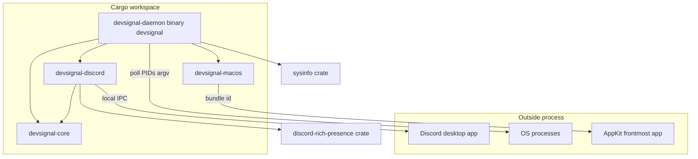
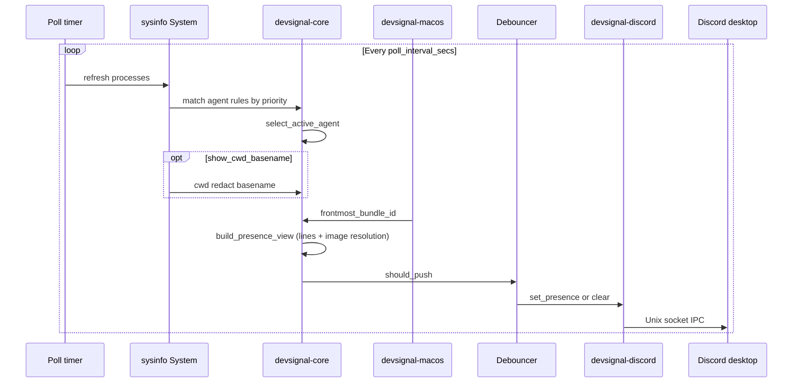
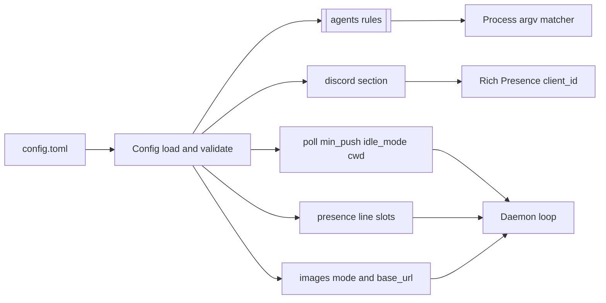
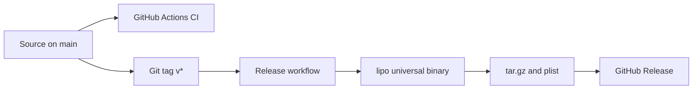

# devsignal

Unified **Discord Rich Presence** for AI coding CLIs on **macOS**. One daemon, one Discord
connection: it detects which agent-style tool is running and shows the **frontmost host app**
(Cursor, VS Code, JetBrains, terminals, etc.).

Ships confirmed presets for **Claude Code**, **Codex**, and **OpenCode**. Ten more — Gemini CLI,
Amp, Cursor Agent, Copilot CLI, Aider, Crush, Qwen Code, Droid, Cline, Goose — are documented as
opt-in snippets in [docs/community-presets.md](docs/community-presets.md), because their process
names have not been verified on a real machine and a preset that silently never matches is worse than
no preset. `devsignal detect --unmatched` tells you what your machine actually reports.

## Discord application setup

1. Open the [Discord Developer Portal](https://discord.com/developers/applications) and **New Application**.
2. In **OAuth2** (optional for local IPC): not required for Rich Presence; you only need the app record.
3. Copy **Application ID** (this is the Rich Presence `client_id`).
4. **Images: nothing to upload** if you use `[images] mode = "url"` — presence images then resolve to
   the PNGs in [`assets/discord/`](assets/discord/), since Discord accepts an image URL wherever it
   accepts an art-asset key. To upload them instead, use **Rich Presence → Art Assets** with
   `mode = "key"`: each **image key** must match what you put in `config.toml` (`large_image` per
   agent, plus the global `devsignal` default), and a key you have not uploaded renders **blank**, so
   upload only the agents you use and delete the `large_image` line for the rest. `devsignal init`
   prints the exact list either way.
5. Install and run the **Discord desktop** client (not only the web app). The daemon connects over local IPC.

## Quick start

1. Run the interactive wizard:

```bash
cargo run -p devsignal-daemon -- init
```

2. Run the daemon:

```bash
cargo run --release -p devsignal-daemon -- run
```

Leave **Discord desktop** open; the daemon talks to it over local IPC. If Discord is not running yet, the daemon **retries IPC for up to 30 seconds** by default (`--wait-for-discord`; use `--no-wait-for-discord` to fail fast).

### Privacy presets

`devsignal init` offers presets, each showing strictly more than the last:

- **Minimal**: agent only. Adds a catch-all rule that hides the host app.
- **Balanced** (default): agent + frontmost host app.
- **Detailed**: also shows the **project folder name** (basename only, never full paths).
- **Custom**: choose per-option.

### Manual setup (fallback)

If you prefer not to use the wizard:

1. Scaffold config (from repo root): `./scripts/setup-local-config.sh` — or copy `config.example.toml` to `~/.config/devsignal/config.toml` yourself.
2. Set `discord.client_id` to your Application ID.

### CLI

| Command | Purpose |
| --- | --- |
| `devsignal` / `devsignal run` | Long-running daemon (default config path unless `--config`) |
| `devsignal init [--config path]` | Interactive onboarding wizard: writes config, validates, optional local install + LaunchAgent |
| `devsignal validate --config ~/.config/devsignal/config.toml` | Load and validate config; print agent rules |
| `devsignal once --config …` | One sample: print the JSON `PresenceView` that `run` would publish (no Discord IPC) |
| `devsignal detect --config …` | Show every process matching an agent rule, which one wins, and why |
| `devsignal detect --unmatched` | Running processes no rule matched — how to find an agent's process name |
| `devsignal watch --config …` | Run the poll loop printing each payload, without touching Discord |
| `devsignal agents add --id … --process-name …` | Add an agent rule (see community presets) |
| `devsignal agents remove <id>` | Delete an agent rule |
| `devsignal --version` | Print the version |
| `devsignal --help` | Usage, including all `rules add` flags |
| `devsignal hosts list/enable/disable` | View or change host app visibility by bundle id |
| `devsignal agents list/enable/disable` | View or change detected AI agent CLIs by agent id |
| `devsignal rules list/add/remove` | Manage first-match presence rules for custom state / hidden host |

### Adding an agent CLI

Only agents with confirmed process names ship as defaults. To track another one:

```bash
# 1. Start the agent CLI in another terminal, then:
devsignal detect --unmatched      # what does this machine actually call it?
devsignal agents add --id gemini_cli --label "Gemini CLI" --process-name gemini --priority 100
devsignal detect                  # confirm it is found and wins
```

[docs/community-presets.md](docs/community-presets.md) has ready-made snippets for ten common CLIs,
plus the collision caveats for short names like `amp`, `crush`, and `goose`. If you confirm one,
please open an issue with the `detect` output so it can ship as a default.

### Releases (prebuilt macOS universal binary)

Tagged releases attach `devsignal-<version>-macos-universal.tar.gz` and the example LaunchAgent plist. Upstream:

```text
https://github.com/rabbive/devsignal/releases/latest
```

Extract the tarball and place `devsignal` on your `PATH` (for example `~/bin/devsignal`).

### Installer script

Standalone, no clone required:

```bash
curl -fsSL https://raw.githubusercontent.com/rabbive/devsignal/main/packaging/macos/install.sh | bash
```

Or from a clone, optionally pinning a version:

```bash
# Optional: override repo (default is rabbive/devsignal)
# export DEVSIGNAL_GITHUB_REPO="yourfork/devsignal"
./packaging/macos/install.sh 0.3.0
```

It downloads the release tarball, **verifies it against the published `SHA256SUMS`**, installs to
`~/bin/devsignal`, clears the Gatekeeper quarantine attribute, scaffolds
`~/.config/devsignal/config.toml` if missing, and — when run interactively — offers to load the
LaunchAgent. Under `curl | bash` there is no TTY, so it points you at `devsignal init` instead.

### Uninstall

```bash
./packaging/macos/uninstall.sh              # asks before deleting your config
./packaging/macos/uninstall.sh --purge      # delete the config too
./packaging/macos/uninstall.sh --keep-config
```

Or standalone, without a clone:

```bash
curl -fsSL https://raw.githubusercontent.com/rabbive/devsignal/main/packaging/macos/uninstall.sh | bash -s -- --keep-config
```

It unloads the LaunchAgent first, so the daemon clears Discord presence on its way out, then removes
`~/Library/LaunchAgents/com.devsignal.daemon.plist`, `~/bin/devsignal`, and
`~/Library/Logs/devsignal`. `~/.config/devsignal` is kept unless you ask for it to go — it holds your
Discord application id and any rules you wrote.

### Gatekeeper and code signing

**Published releases are currently unsigned.** The release workflow signs and notarizes only when the
maintainer's Apple credentials are configured in CI, and they are not; with none configured it
publishes an unsigned binary and says so in the run log. Since macOS quarantines anything downloaded,
an unsigned binary is blocked outright until the attribute is cleared.

`install.sh` clears it for you. If you install by hand, do it yourself:

```bash
xattr -d com.apple.quarantine ~/bin/devsignal
```

### macOS permissions

Host detection prefers **AppKit** (`NSWorkspace` / `NSRunningApplication`). If that path returns nothing **twice in a row**, the daemon falls back to AppleScript (`osascript`) against **System Events**, which may prompt for **Automation** access for the app that launches `devsignal` (for example Terminal, iTerm2, or Cursor).

## What the card shows

Discord draws three lines, and the first one is the **application's** name unless you override it:

| Line | Config | Default |
| --- | --- | --- |
| 1 | `presence.name` | `off` → the Discord application name (`devsignal`) |
| 2 | `presence.details` | `agent` → `Claude Code` |
| 3 | `presence.state` | `host` → `In Ghostty` |

Each slot takes `agent`, `host`, `project`, `brand` (`presence.brand_text`), or `off`. Two slots may
not carry the same value, and `project` requires `show_cwd_basename = true` — both are load-time
errors rather than a blank line at runtime.

To lead with the agent instead of the app name:

```toml
[presence]
name    = "agent"    # Claude Code
details = "host"     # In Ghostty
state   = "brand"    # devsignal   (or "project" with show_cwd_basename = true)
```

`name` overrides the activity name Discord would otherwise take from your application. Check it in
your own client the first time: if line 1 still reads `devsignal`, your client is ignoring the
override — rename the application in the Developer Portal, or keep the default order.

### Images

Every agent and host app ships a 512×512 PNG in [`assets/discord/`](assets/discord/). Discord accepts
a plain `https://` image URL wherever it accepts an uploaded art-asset key, so nothing has to be
uploaded:

```toml
[images]
mode      = "url"
base_url  = "https://raw.githubusercontent.com/rabbive/devsignal/main/assets/discord"
host_icon = true     # frontmost editor/terminal as the small corner icon
```

`mode = "key"` (the default) keeps the original behaviour: image values are art-asset keys you upload
yourself — the same PNGs, filename minus `.png` as the key. `host_icon` is best left off in key mode
unless you upload one per host (`devsignal hosts list` prints them). An image value that is already an
absolute `http(s)` URL is passed through in either mode, so one agent can point at its own art.

`host_icon` follows the host *label*: anything that hides the label — `platforms.disabled_hosts`, a
rule's `hide_host` — hides the icon too, so the app cannot leak through its image.

## Configuration

- `poll_interval_secs`: how often processes and the frontmost app are sampled.
- `min_push_interval_secs`: minimum time between Discord presence updates unless the active agent changes (reduces flicker and rate limits).
- `idle_mode`: `status` (default) shows an idle line when no agent is detected; `clear` calls Discord **CLEAR_ACTIVITY** so nothing is shown for this application.
- `show_cwd_basename`: when `true`, appends the **basename only** of the winning agent process working directory (never full paths). Off by default for privacy.
- `[[agents]]`: `process_names` match **case-insensitively** against the `sysinfo` process name **or** the **basename of argv0** (so wrapped CLIs like `node …/codex` can match `codex`). Optional `argv_substrings` narrow matches when non-empty — **at least one** must appear in the command line (case-insensitive).
- `priority`: **lower number wins** when multiple agents match.
- `[presence]`: which of Discord's three lines carries the agent, host, project, or brand text — see [What the card shows](#what-the-card-shows).
- `[images]`: `mode = "url"` resolves image names to hosted PNGs under `base_url`; `mode = "key"` treats them as uploaded art-asset keys. `host_icon` puts the frontmost editor/terminal in the small corner slot.
- `[platforms]`: `disabled_hosts` hides selected host app bundle ids; `disabled_agents` ignores selected agent ids. All known hosts/agents are enabled by default.
- `[[rules]]`: first-match presence rules. Conditions can match host bundle ids, agent ids, active/idle state, project basename, and local time windows. Actions can hide the host and/or override the state line.

Example rule:

```toml
[[rules]]
name = "terminal_deep_work"
when = { host_bundle_ids = ["com.apple.Terminal"], agent_ids = ["claude_code"], active_only = true }
then = { hide_host = true, state = "Deep work" }
```

## Architecture

The repo is a **Rust workspace**: shared logic in `devsignal-core`, macOS host detection in `devsignal-macos`, Discord IPC in `devsignal-discord`, and the `devsignal` CLI / main loop in `devsignal-daemon`.

### Crate map


```mermaid
flowchart TB
  subgraph ws [Cargo workspace]
    daemon[devsignal-daemon binary devsignal]
    core[devsignal-core]
    discordCrate[devsignal-discord]
    macosCrate[devsignal-macos]
  end

  daemon --> core
  daemon --> discordCrate
  daemon --> macosCrate
  daemon --> sysinfo[sysinfo crate]
  discordCrate --> core
  discordCrate --> drp[discord-rich-presence crate]

  subgraph external [Outside process]
    discApp[Discord desktop app]
    osProc[OS processes]
    appKit[AppKit frontmost app]
  end

  daemon -->|poll PIDs argv| osProc
  macosCrate -->|bundle id| appKit
  discordCrate -->|local IPC| discApp
```

- **`devsignal-core`**: config (`toml`), agent rules, matching, `PresenceView`, debouncing — no UI, no Discord.
- **`devsignal-macos`**: frontmost application / host surface on macOS (AppKit).
- **`devsignal-discord`**: Rich Presence via `discord-rich-presence` → Discord **desktop** IPC.
- **`devsignal-daemon`**: CLI (`run` / `validate` / `once`), main loop: processes → agent → optional CWD hint → bundle → presence → debounce → push or clear.

### Runtime flow (`devsignal run`)


```mermaid
sequenceDiagram
  participant Timer as Poll timer
  participant Sys as sysinfo System
  participant Core as devsignal-core
  participant Mac as devsignal-macos
  participant Deb as Debouncer
  participant DRP as devsignal-discord
  participant DC as Discord desktop

  loop Every poll_interval_secs
    Timer->>Sys: refresh processes
    Sys->>Core: match agent rules by priority
    Core->>Core: select_active_agent
    opt show_cwd_basename
      Sys->>Core: cwd redact basename
    end
    Mac->>Core: frontmost_bundle_id
    Core->>Core: build_presence_view (lines + image resolution)
    Core->>Deb: should_push
    Deb->>DRP: set_presence or clear
    DRP->>DC: Unix socket IPC
  end
```

On **SIGINT/SIGTERM**, the daemon clears Rich Presence for this Discord application, then exits.

### Config and policy


```mermaid
flowchart LR
  toml[config.toml] --> load[Config load and validate]
  load --> agents[[agents rules]]
  load --> discordSec[discord section]
  load --> policy[poll min_push idle_mode cwd]
  load --> lines[presence line slots]
  load --> imgs[images mode and base_url]
  agents --> match[Process argv matcher]
  policy --> loop[Daemon loop]
  lines --> loop
  imgs --> loop
  discordSec --> ipc[Rich Presence client_id]
```

### Build and release


```mermaid
flowchart LR
  src[Source on main]
  ci[GitHub Actions CI]
  tag[Git tag v*]
  rel[Release workflow]
  uni[lipo universal binary]
  tb[tar.gz and plist]
  gh[GitHub Release]

  src --> ci
  src --> tag
  tag --> rel
  rel --> uni
  uni --> tb
  tb --> gh
```

CI runs **fmt** and **clippy** (Linux exercises Linux-safe crates; macOS runs the **full** workspace). Pushing a **`v*`** tag triggers [`.github/workflows/release.yml`](.github/workflows/release.yml): cross-compile **aarch64** and **x86_64**, **`lipo`** a universal `devsignal`, package `devsignal-<version>-macos-universal.tar.gz` and attach the example LaunchAgent plist to the release.

### Extension points

| Area | Today | Natural next step |
| --- | --- | --- |
| Host OS | macOS-only host code in `devsignal-macos` | Separate crate + shared traits in core for other platforms |
| Agents | TOML `process_names` / `argv_substrings` | More rules or config reload |
| Discord | Local IPC to desktop client | Unchanged for Rich Presence; assets stay in the Developer Portal |
| Distribution | Unsigned release binary in CI | Optional `codesign` / `notarytool` for Gatekeeper-friendly installs |

## LaunchAgent (login item)

Use an absolute path to the `devsignal` binary in the plist **ProgramArguments**.

Example plist: [`packaging/macos/com.devsignal.daemon.example.plist`](packaging/macos/com.devsignal.daemon.example.plist)

Suggested log directory (referenced in the plist):

```text
~/Library/Logs/devsignal/
```

Create it before loading the agent:

```bash
mkdir -p ~/Library/Logs/devsignal
```

Copy the plist to `~/Library/LaunchAgents/`, edit paths, then:

```bash
launchctl bootstrap gui/$(id -u) ~/Library/LaunchAgents/com.devsignal.daemon.plist
```

Privacy defaults: keep `show_cwd_basename = false` unless you are comfortable exposing folder names in Discord.

### Graceful shutdown

Press **Ctrl+C** (or send **SIGTERM**): the daemon clears Discord presence for this application before exiting.

## macOS only (for now)

Other platforms fail fast until host detection and packaging are added.

## Troubleshooting

**Where are the logs?** `~/Library/Logs/devsignal/devsignal.err.log` under the LaunchAgent (all
`tracing` output goes to stderr; the `.out.log` file stays near-empty). The plist sets `RUST_LOG=warn`;
raise it to `info` or `debug` there while diagnosing something, and lower it again afterwards — launchd
appends to these files forever with no rotation.

**Nothing appears in Discord.**

1. `devsignal detect` — does it name your agent CLI and a matched rule? If not, see below.
2. `devsignal validate` — a config that fails to load stops everything. Since v0.3.0 unknown keys are
   an error, so a typo'd key is named explicitly.
3. Is the Discord **desktop app** running? The browser client has no IPC socket and cannot work.
4. Check `discord.client_id` against the application id in the
   [Developer Portal](https://discord.com/developers/applications). Presence is published *as* that
   application; a wrong id publishes to something you are not looking at.
5. Discord's "Activity Privacy" → *Share your detected activities with others* must be on.

**Presence stopped updating after I restarted Discord.** Fixed in 0.4.0. Earlier versions recorded a
failed push as delivered and then deduplicated against it forever, so the daemon stayed alive and
silent. If you are on 0.4.0 or later and still see this, the log will contain
`presence push failed; will keep retrying` — attach that.

**My agent CLI is not detected.** Run it, then:

```bash
devsignal detect --unmatched     # processes no rule matched
```

Find its process name in that list and add it with `devsignal agents add --id myagent --process-name
<name>`. Wrapped Node CLIs are matched on `basename(argv[0])` too, so `node .../codex` matches
`codex`. `docs/community-presets.md` has snippets for CLIs whose names are not yet confirmed.

**The tiles are blank.** With `images.mode = "key"` (the default) every image name must be uploaded as
an art asset in the Developer Portal — an un-uploaded key renders as an empty tile with nothing in the
logs. `devsignal validate` prints the keys to upload. `mode = "url"` serves the PNGs from this repo
instead and needs no uploads.

**The first line says "devsignal" instead of my agent.** That line is the Discord *application's* name.
Set `presence.name = "agent"` to override it; if your client ignores the override, rename the
application in the Developer Portal instead.

**"another devsignal is already running".** Two daemons would fight over the card, so the second one
refuses to start. Usually a hand-run `devsignal run` while the LaunchAgent is loaded:

```bash
launchctl bootout gui/$(id -u)/com.devsignal.daemon    # stop the background one
pgrep -fl devsignal                                    # or find it directly
```

**macOS keeps asking for Automation permission.** Host detection prefers AppKit; only after two
consecutive misses does it fall back to AppleScript against System Events, which needs that permission.
Granting it to whichever app launches `devsignal` stops the prompts.

**How do I remove it?** See [Uninstall](#uninstall).

## Maintainer notes: signing / notarization

[`.github/workflows/release.yml`](.github/workflows/release.yml) already implements signing **and**
notarization; it is gated on five repository secrets:

| Secret | Purpose |
|---|---|
| `APPLE_CERT_P12_BASE64` | base64 of the Developer ID Application certificate (`.p12`) |
| `APPLE_CERT_PASSWORD` | its export password |
| `APPLE_NOTARY_API_KEY` | App Store Connect API key (`.p8`) contents |
| `APPLE_NOTARY_KEY_ID` | that key's id |
| `APPLE_NOTARY_ISSUER_ID` | the issuer id |

Set **all five or none**: a partial set is a hard error by design, so a half-configured repo fails
loudly instead of quietly shipping unsigned. With none set the workflow publishes an unsigned binary
and emits a warning annotation — which is the current state of published releases.

Notarization tickets cannot be stapled to a bare executable, so Gatekeeper performs an online check on
first run. Use the workflow's `workflow_dispatch` trigger to dry-run the whole pipeline before a real
tag, so signing's first execution is not also a release.

## License

MIT
